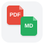

# ZoteroPDF2MD — Convert PDF to Markdown for Zotero

**Repository:** `zotero-pdf-to-md`

**Transform research PDFs into Markdown with one click.** The easiest PDF to Markdown converter for Zotero. Perfect for researchers, students, and LLM workflows.



**Version:** 0.1.0 | **Status:** ✅ Fully Functional | **Target:** Zotero 8.0.4+ | **License:** MIT

---

## What Is ZoteroPDF2MD?

ZoteroPDF2MD brings the power of intelligent PDF parsing directly into Zotero. Convert your research PDFs into beautifully structured Markdown files with a single right-click. Built for researchers, students, and anyone who needs to transform PDFs into machine-readable content for LLMs, note-taking, and data extraction workflows.

### Key Features
- ✅ **One-click PDF to Markdown conversion** — Right-click any PDF in Zotero
- ✅ **Powered by MarkItDown** — Microsoft's robust PDF parser
- ✅ **Smart output** — Save alongside PDF or to a custom folder
- ✅ **LLM-ready** — Perfect for prompt engineering & document parsing
- ✅ **Cross-platform** — Windows, Mac, Linux support
- ✅ **Configurable** — Custom Python path & output directory

---

## Installation

### Requirements
- **Zotero 8.0.4** or later
- **Python 3.8+** with `markitdown` package

```bash
pip install markitdown
```

### Install ZoteroPDF2MD
1. Download `pdf2md_v0.xpi` from [Releases](https://github.com/yourusername/zotero-pdf-to-md/releases)
2. Open Zotero → **Tools** → **Add-ons** → ⚙️ **Settings** → **Install Add-on From File**
3. Select `pdf2md_v0.xpi`
4. Restart Zotero when prompted

---

## Quick Start

### Configure Python Path
1. **Edit** → **Preferences** → **PDF to MD** tab
2. **Click Browse** to select your Python executable
   - Windows: `C:\Users\YourName\AppData\Local\Programs\Python\Python311\python.exe`
   - Mac/Linux: `/usr/bin/python3`
3. **Click Test** to verify Python & MarkItDown work

### Convert PDFs
1. Select one or more items with PDF attachments
2. Right-click → **Transform PDF to MD**
3. Done! Your `.md` files appear in seconds

### Custom Output Folder (Optional)
- **Preferences** → **PDF to MD** → Enable "Save to custom directory"
- By default, `.md` files save next to the PDF

---

## Use Cases

### 📚 Academic Research
Extract text & structure from research papers, maintain in Markdown for analysis

### 🤖 LLM Prompt Engineering
Convert PDFs to Markdown for cleaner prompt injection & document understanding

### 📝 Note-Taking & PKM
Build Markdown-based personal knowledge management from your PDF library

### 🔍 Document Parsing
Batch convert PDFs to structured text for data extraction workflows

### 💼 Professional Documentation
Transform reports, whitepapers, and presentations into editable Markdown

---

## Configuration

### Settings (Edit → Preferences → PDF to MD)

| Setting | Description |
|---------|-------------|
| **Python Path** | Full path to Python executable (required) |
| **Test Button** | Verify Python & MarkItDown installation |
| **Engine** | Conversion engine (MarkItDown by default) |
| **Custom Folder** | Optional: save `.md` files to a specific folder |

---

## Troubleshooting

### ❌ "No Python found" or Test fails
**Solution:**
- Verify Python installed: `python --version`
- Use full path (not just `python` or `python3`)
- Windows: `C:\Users\YourName\AppData\Local\Programs\Python\Python311\python.exe`
- Mac: `/usr/local/bin/python3` or `/opt/homebrew/bin/python3`
- Linux: `/usr/bin/python3`

### ❌ MarkItDown not found
```bash
pip install markitdown
```

### ❌ Conversion fails silently
- Check Zotero debug console: **Tools** → **Developer Tools** → **Console**
- Verify output folder is writable
- Try the default location (next to PDF) first

### ❌ Files not appearing
- Ensure output folder has write permissions
- Check folder path has no special characters
- Restart Zotero and retry

---

## Architecture & Technical Details

### How It Works

```
User right-clicks PDF → Menu fires → Python script runs →
MarkItDown parses PDF → Markdown written to file → Done ✓
```

### Why This Approach?

**Windows Compatibility**
- Uses `nsIProcess` (not `exec()`) to avoid stdout issues on Windows
- Python writes output to temp file, Zotero reads it back

**Reliable DOM Access**
- Preferences pane scripts run before DOM is ready
- Uses `setTimeout` polling (not `load` event) for stable DOM initialization

**Python Integration**
- Fetches Python script from XPI, writes to temp, executes via nsIProcess
- Temp file output strategy ensures cross-platform compatibility

### Project Files

| File | Purpose |
|------|---------|
| `bootstrap.js` | Plugin lifecycle & startup hooks |
| `pdf2md.js` | Menu registration & PDF conversion engine |
| `preferences.xhtml` | Settings UI (HTML) |
| `preferences.js` | Settings logic, file picker, Python test |
| `scripts/pdf_to_md.py` | Python: MarkItDown PDF→Markdown converter |
| `manifest.json` | Zotero plugin metadata |

---

## Development

### Build the XPI Yourself

```bash
cd src/
zip -r ../pdf2md_v0.xpi .
```

Then install in Zotero as above.

### Key Technologies

- **Framework:** Zotero 8 JavaScript API
- **Python Engine:** [MarkItDown](https://github.com/microsoft/markitdown) (Microsoft)
- **Process Management:** Mozilla `nsIProcess`
- **File I/O:** Mozilla `IOUtils` & `PathUtils`

---

## Roadmap

### ✅ Complete
- PDF to Markdown conversion (MarkItDown)
- Zotero 8 menu integration
- Custom output folder
- Python configuration UI
- Windows, Mac, Linux support

### 🔄 In Progress
- Docling engine support (IBM alternative)
- Batch progress bar

### 📋 Future
- Custom extraction templates
- Markdown + metadata (author, title, DOI)
- Cloud storage integration
- Web UI for PDF uploads

---

## FAQ

**Q: Does it work with scanned PDFs?**
A: MarkItDown handles scanned PDFs, but OCR quality varies. Native PDFs work best.

**Q: Can I customize the output format?**
A: Currently outputs standard Markdown. Custom templates coming soon.

**Q: Is my data sent anywhere?**
A: No. All processing is local. PDFs never leave your computer.

**Q: Why do I need Python installed?**
A: MarkItDown (the PDF parser) runs in Python. It's the best open-source PDF→Markdown tool.

**Q: Can I use a different PDF converter?**
A: Docling support is planned. Submit an issue if you have other suggestions.

---

## Contributing

Found a bug? Have a feature request?

→ [Open an Issue](https://github.com/yourusername/zotero-pdf-to-md/issues)

→ [Submit a Pull Request](https://github.com/yourusername/zotero-pdf-to-md/pulls)

---

## License

MIT License — Free for personal and commercial use.

See [LICENSE](LICENSE) file for details.

---

## Credits

- **MarkItDown** — [Microsoft](https://github.com/microsoft/markitdown)
- **Zotero** — [Center for History and New Media](https://www.zotero.org/)
- **ZoteroPDF2MD** — Built with ❤️ for researchers

---

## Keywords

*PDF to Markdown, Zotero plugin, PDF converter, Markdown extractor, document parser, LLM tools, research workflow, MarkItDown, PDF extraction, batch conversion, academic tools, PDF2MD, Zotero extension*

---

**Convert your research PDFs to Markdown in one click.** 📄➜📝

Made by [@rsrs](https://github.com/rsrs) | March 2026
